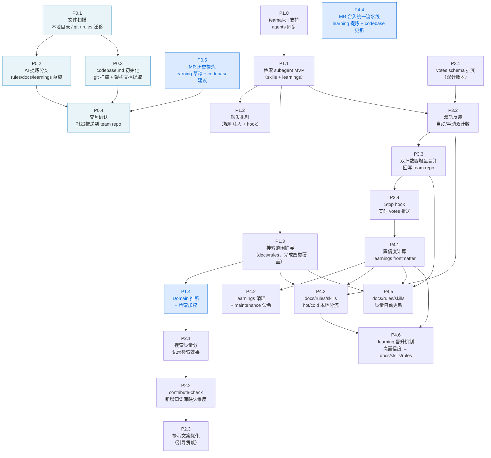

# teamai-cli 知识库自动维护系统 Roadmap

> 实施原则：最小改动优先，复用现有基础设施（hooks、pushRepoDirectly、buildIndex、injectClaudeMdSection 等），各步骤独立可验证。

---

## 系统全局架构

teamai-cli 构建了一个**知识检索 → 知识反馈 → 知识生产**的团队智能闭环，三个阶段相互驱动，使团队知识随使用持续自我演进。

```mermaid
flowchart LR
    subgraph A ["🔍 知识检索"]
        direction TB
        a1["teamai-recall subagent\n（独立上下文，不占主对话窗口）"]
        a2["四类知识库：learnings / skills\ndocs / rules"]
        a3["hot/cold 分层 + confidence 排序\n优先返回活跃、高质量条目"]
    end

    subgraph B ["📊 知识反馈"]
        direction TB
        b1["recalled_count / upvoted_count\n双计数器区分「检索」与「采用」"]
        b2["Stop hook 自动解析 transcript\n近实时推送 votes 到团队仓库"]
        b3["confidence 动态计算\n写入 learning frontmatter，全团队共享"]
    end

    subgraph C ["✍️ 知识生产"]
        direction TB
        c1["teamai contribute / share-learnings\n经验总结主动入库"]
        c2["contribute-check 触发提示\n知识库空白时引导贡献"]
        c3["质量自动更新 / teamai import\n低质量淘汰，历史文档迁移入库"]
        c4["codebase MR 自动检查\n提 MR 后感知接口与调用变更"]
        c5["learning 晋升机制\n高置信度条目按内容类别\n沉淀为 docs / skills / rules"]
    end

    A -->|"采用/忽略信号\n反映知识实际价值"| B
    B -->|"触发贡献提示\n淘汰低置信度条目\n驱动质量更新"| C
    C -->|"新知识入库\n更新检索索引\nconfidence 初始化"| A
```



> **三个阶段的角色**：
> - **知识检索**：每次任务开始前由 `teamai-recall` subagent 完成，结果以精简摘要注入主对话，不消耗主对话上下文窗口
> - **知识反馈**：Session 结束时由 Stop hook 自动采集使用信号，无需用户手动操作；votes 数据驱动 confidence 持续收敛
> - **知识生产**：涵盖主动贡献（contribute）、被动触发（contribute-check）、历史迁移（import）、代码变更感知（MR 检查）四条入库路径

---

## 里程碑时间表

| 日期 | 里程碑 | 说明 |
|------|-------|------|
| **6/12** | 完成 Phase 1：检索 Subagent | `teamai-recall` subagent 可用，支持 skills + learnings + docs/rules 四类知识库检索；CLAUDE.md 注入触发规则 |
| **6/19** | 完成 Phase 0：冷启动（与 Phase 2 并行交付）| `teamai import` 可用；新团队一条命令完成知识库迁移与 `codebase.md` 初始化，配合软上线开箱即有非空知识库 |
| **6/19** | 完成 Phase 2：Contribute-check 优化 + **MVP 上线** | Contribute-check 感知知识库空白；**向业务团队开放试用**，团队成员 `teamai pull` 后即可使用检索功能，开始积累真实 votes 数据 |
| **6/26** | 完成 Phase 3：Vote 双计数器 | recalled_count / upvoted_count 双轨计数，Stop hook 近实时推送 votes 到团队仓库 |
| **7/3** | 完成 Phase 4 主链：自动维护系统 | confidence 写入 learnings frontmatter（基于 2 周真实数据）；hot/cold 分流；maintenance 清理命令；codebase 文档命令；**learning 晋升机制** |
| **7/10** | 完成 Phase 4 完整：P4.5 质量自动更新 | docs/rules/skills 质量更新机制完整可用 |
| **7/17** | v1.0 正式发布 | 全链路集成测试通过，P1 级 bug 清零，正式交付团队日常使用 |

---

## 各阶段概览

### Phase 0：冷启动（知识迁移 + Codebase 初始化）（6/12–6/19）

> **太长不看**：新团队接入 teamai 时知识库为零，Phase 1–4 的检索、反馈与自动维护无从发挥。本阶段提供 `teamai import` 命令，将团队现有的零散文档（本地 Markdown、老的 Claude/Cursor rules 目录、架构设计文档）和 git 工作目录一次性迁移到 teamai 知识库，同时生成 `codebase.md` 初始版本。整个流程分四步：扫描发现 → AI 提炼分类 → 交互确认 → 批量推送，目标是让新团队在软上线当天就拥有一个非空、有实际价值的知识库起点，而非从冷数据开始积累。

**包含步骤**：
- P0.1：文件扫描与发现（支持本地目录、git 工作目录、老规则目录迁移）
- P0.2：AI 分类提炼（生成 rules / docs / learnings 草稿，含去重检测）
- P0.3：codebase.md 初始化（git 仓库扫描 + 架构文档语义提取，合并进 import 流程）
- P0.4：交互确认 + 批量推送到 team repo
- <span style="color:#0969da">P0.5：MR 历史提炼（扫描近期 merged MR → AI 提炼 learning 草稿 + codebase.md 变更建议 → 并入 P0.4 确认流程；dedup 检测与 session learning 的重叠）</span>

### Phase 1：检索 Subagent（6/5–6/12）

> **太长不看**：当前 agent 不会主动检索知识库，且检索结果直接注入主对话上下文，随知识库增大持续膨胀。本阶段新建一个以 **subagent 形式运行**的检索 agent（`teamai-recall`），主对话通过 Agent tool 调用它，检索过程在独立上下文中完成，结果以精简摘要返回——主对话上下文不受影响。同时扩展 teamai-cli 的同步能力（支持 agents 目录），并在 CLAUDE.md 中注入规则保证任务执行前自动触发检索；搜索范围分两步扩展：MVP 阶段覆盖 skills + learnings，再扩展至 docs/rules 完成四类知识库全覆盖。

**包含步骤**：
- P1.0：扩展 teamai-cli 支持同步 agents 目录
- P1.1：新建 teamai-recall 检索 subagent（覆盖 skills + learnings）
- P1.2：CLAUDE.md 注入检索触发规则 + TodoWrite hook 兜底
- P1.3：搜索范围扩展至 docs/rules（四类知识库全覆盖）
- <span style="color:#0969da">P1.4：Domain 推断 + 检索加权（tags/路径/类型推断内容域；technical × 1.0、ops × 0.5、support × 0.3；skills/rules 类型额外 × 1.1）</span>

### Phase 2：Contribute-check 优化（6/12–6/19）

> **太长不看**：当前 contribute-check 只根据 session 的工具调用量和多样性判断是否值得贡献经验，无法感知"知识库是否已覆盖本次任务"。本阶段在现有评分机制上新增一个维度：将本次 session 的知识库召回质量分（检索命中率）写入评分，若检索均未命中则判定为"知识库空白"，触发更强的贡献提示，引导 agent 调用 `/teamai-share-learnings` 自动生成并推送经验总结。

**包含步骤**：
- P2.1：recall-cache 记录搜索质量分
- P2.2：contribute-check 新增知识库空白维度
- P2.3：优化贡献提示文案

> 🚀 **软上线节点**：Phase 2 验收通过后（6/19），即可向业务团队开放使用。四类知识库检索完整，触发机制就位，团队成员执行 `teamai pull` 后自动生效。Week 3–4 积累的真实 votes 数据将驱动 Phase 4 的 confidence 计算，避免冷启动。：Phase 2 验收通过后（6/19），即可向业务团队开放使用。四类知识库检索完整，触发机制就位，团队成员执行 `teamai pull` 后自动生效。Week 3–4 积累的真实 votes 数据将驱动 Phase 4 的 confidence 计算，避免冷启动。

### Phase 3：Vote 双计数器（6/19–6/26）

> **太长不看**：现有 vote 机制是"命中即投票"，无法区分"知识条目被检索到"和"知识条目被实际采用"两个不同信号，导致后续自动维护系统缺乏准确的数据基础。本阶段将 vote 拆分为 `recalled_count`（被检索到次数）和 `upvoted_count`（被主对话声明参考次数）双计数器，通过 Stop hook 读取 session transcript 自动计算两者差值，同时提供 `teamai recall feedback` 命令供用户手动反馈；新增 Stop hook 在 session 结束时近实时推送 votes 到团队仓库，避免置信度更新滞后一个 session。

**包含步骤**：
- P3.1：votes schema 扩展为双计数器（recalled_count + upvoted_count）
- P3.2：recalled/upvoted 事件拆分 + 自动/手动双轨反馈
- P3.3：双计数器增量 merge 回写 team repo（多设备安全）
- P3.4：Stop hook 近实时推送 votes

### Phase 4：自动维护系统（6/26–7/10）

> **太长不看**：基于 Phase 3 积累的双计数器数据，本阶段实现知识库的全生命周期自动管理。核心是为每条 learning 引入 **置信度（confidence）**：根据团队整体的召回/采用行为动态计算，直接写入 .md 文件 frontmatter，全团队共享同一份置信度视图。在此基础上：低置信度 learnings 由 `teamai maintenance` 命令扫描候选后人工确认删除；docs/rules/skills 不删除，改为本地 hot/cold 路径分流，检索时优先命中活跃知识；当某条 doc/rule/skill 被反复召回但不被采用（"召回但忽略"率超阈值），结合用户实际采用的 learnings 作为输入，由 agent 生成更新草稿，人工确认后推送；**当某条 learning 置信度持续积累到高阈值时（不区分来源与 domain），系统提示将其按内容类别晋升为 docs / skills / rules，实现经验知识向规范知识的正式沉淀**；此外新增 `teamai docs codebase` 命令维护团队 codebase 梳理文档，供检索 subagent 在每次任务开始时提供仓库上下文。

**包含步骤**：
- P4.1：置信度（confidence）写入 learnings frontmatter，基于团队真实 votes 数据
- P4.2：learnings 低置信度候选清理命令 `teamai maintenance --prune`
- P4.3：docs/rules/skills 本地 hot/cold 路径分流，优先检索活跃知识
- <span style="color:#0969da">P4.4：MR 合入统一处理流水线（一次解析 diff + MR description + commit message，双路输出：① learning 草稿提炼 + dedup；② codebase.md 变更建议，含架构决策 why；触发时机统一改为 MR merged）</span>
- P4.5：docs/rules/skills 质量自动更新机制（依赖真实数据，第 5 周实现）
- P4.6：learning 晋升机制（confidence 达阈值后按内容类别提示晋升为 docs / skills / rules）

---

## 价值评估指标

> 以下指标可由系统直接采集，无需额外埋点。建议在 6/19 软上线时记录基线快照，每两周更新一次，用于向项目负责人汇报进展。

### 检索质量指标

| 指标 | 定义 | 计算方式 |
|------|------|---------|
| **检索命中率** | 调用 teamai-recall 且返回 ≥1 条结果的 session 比例 | `有结果的 recall 次数 / 总 recall 次数` |
| **知识采用率** | 被检索到的知识条目中，实际被主对话采用的比例 | `sum(upvoted_count) / sum(recalled_count)`（全库汇总）|
| **召回但忽略率** | 被检索但不被采用的比例，反映知识质量问题 | `1 - 知识采用率`；持续上升说明知识库质量在下降 |
| **平均 confidence** | 全库 confidence 均值及高/中/低分布 | 直接从 learnings frontmatter 聚合 |

### 知识库健康度指标

| 指标 | 定义 | 说明 |
|------|------|------|
| **活跃知识比例** | hot/ 中条目数 / 总条目数 | `last_recalled_at ≤ 90 天`的占比，反映知识是否在被使用 |
| **知识积累速率** | 每月新增 learnings / skills / docs 数量 | 持续增长说明团队在主动沉淀 |
| **知识复用次数** | 单条 learning 的 recalled_count 均值 / 最大值 | 一条 learning 被 10 次召回 = 节省了 10 次重新摸索 |
| **贡献人数覆盖** | 有 vote 记录的成员数 / 总成员数 | 反映系统渗透率，是否只有少数人在用 |

### 可量化业务价值

**知识复用节省时间（每月估算）**

```
节省时间 = 本月 upvoted_count 总次数 × 平均每条 learning 对应的"摸索时间"
```

示例：若每月 upvoted 80 次，每次平均节省 45 分钟 → 每月节省约 60 小时。

**贡献转化漏斗**

```
参与 coding session 的成员数
  ↓ teamai-recall 调用率（有多少人在真正用检索）
  ↓ 有采用记录的成员数（upvote 发生）
  ↓ 主动贡献新 learning 的成员数（teamai-share-learnings 调用次数）
```

漏斗越"窄"说明哪个环节有摩擦，可针对性优化。

### 长期价值指标（趋势观测）

| 指标 | 观测方式 | 价值论点 |
|------|---------|---------|
| 新人上手时间 | 对比引入系统前后，新成员解决第一个真实任务的时间 | 知识库把老人经验变成新人可检索的资产 |
| 重复问题减少 | 观察团队 IM 中"有没有人做过 X"类问题的频率 | 检索命中 = 少一次群里问 |
| 跨成员知识传播 | 一条 learning 被 N 名不同成员 upvoted | 说明知识跨越了"仅对某人有用"的边界 |
| knowledge half-life | confidence 下降到 0.5 所需时间的分布 | 反映知识是否随业务演进而失效 |

### 基线快照（6/19 软上线时记录）

建议在软上线当天记录以下数据作为对比基准：

| 基线项 | 记录方式 |
|--------|---------|
| 当前 learnings 总数 | `ls ~/.teamai/learnings/ \| wc -l` |
| 当前 skills 总数 | `ls ~/.claude/skills/ \| wc -l` |
| 团队参与成员数 | 手动统计 |
| 近 1 个月 IM 中"有没有人做过 X"类问题数 | 估算即可 |

---

## 上线与迭代计划

### 发布节奏

| 时间点 | 状态 | 说明 |
|--------|------|------|
| Week 1 末（6/12） | 阶段交付 | Phase 1 验收通过，检索链路可用 |
| **Week 2 末（6/19）** | 🚀 **软上线** | MVP 向业务团队开放试用，开始积累真实 votes 数据 |
| Week 4 末（7/3） | 🔔 功能更新 | confidence + hot/cold 上线，基于 2 周真实数据驱动 |
| Week 5 末（7/10） | 🔔 功能更新 | P4.5 质量自动更新完整可用 |
| **Week 6 末（7/17）** | 🎯 **v1.0 正式发布** | 集成测试通过，P1 级 bug 清零，正式交付 |

### 上线后迭代原则

- **以修为主，以加为辅**：上线后首月优先修复影响使用的体验问题，克制新功能冲动
- **数据驱动参数调整**：confidence 公式系数、contribute-check 分数阈值均需真实数据校准
- **每两周收集一次反馈**，整理 backlog，排优先级决定是否进入下一轮迭代

### 迭代计划摘要

| 阶段 | 时间 | 重点工作 |
|------|------|---------|
| Iter-1 | 上线后第 1–2 周 | P1 bug 修复 + confidence 参数校准 + P4.5 生产验证 |
| Iter-2+ | 上线后第 3 周起 | 按反馈频率驱动：参数调优、体验优化、新需求按频率纳入 |

> 详细开发日程与验收项见**附录 D**。

---

# 附录

> 以下内容面向管理与汇报，包含各阶段核心目标、步骤依赖关系、详细开发日程与阶段验收清单。

---

## 附录 A：全局任务依赖图



> **P4.4（MR 合入统一流水线）** 不依赖其他步骤，可在任意阶段并行启动。
> **P0.5（MR 历史提炼）** 与 P0.1–P0.3 并行，最终汇入 P0.4 确认流程。
> **P1.1** 是最小可用版本，完成后即可体验检索 subagent 核心价值。

---

## 附录 B：各阶段核心实现概览

### Phase 0：冷启动（知识迁移 + Codebase 初始化）

> **太长不看**：新团队接入 teamai 时知识库为零，本阶段提供 `teamai import` 命令，将团队现有的零散文档（本地 Markdown、老的规则目录、架构设计文档）和 git 工作目录一次性迁移到知识库，同时生成 `codebase.md` 初始版本。整个流程分四步：扫描发现 → AI 提炼分类 → 交互确认 → 批量推送。

#### P0.1　文件扫描与发现

**背景**：新团队的知识散落在各处——本地目录的 Markdown 文档、已有的规则、架构设计文档、git 工作目录的 README。扫描阶段的目标是"发现一切可能有价值的来源"，输出候选文件列表，暂不做 AI 处理。

**命令设计**：

```
teamai import [OPTIONS]

选项（至少指定一个来源，可组合使用）：
  --dir <path>        扫描指定目录下的文档文件（.md / .txt / .docx / .pdf）
  --workspace <path>  扫描工作目录下的所有 git 仓库（用于 codebase 初始化）
  --from-claude       迁移 ~/.claude/rules/ 和 ~/.claude/skills/ 目录
  --from-cursor       迁移 ~/.cursor/rules/ 目录
  --from-iwiki <space-id-or-url>
                      从腾讯内部 iWiki 拉取指定 Space 的页面树并批量导入
                      支持 Space ID（数字）或完整页面 URL；需配置 TAI_PAT_TOKEN
  --resume            恢复上次中止的 import 进度

推荐组合（新团队首次接入）：
  teamai import --dir ~/team-docs/ --workspace ~/workspace/ --from-claude
  teamai import --from-iwiki 12345678                            # 按 Space ID 导入 iWiki 整个空间
  teamai import --from-iwiki https://iwiki.woa.com/pages/xxx     # 按页面 URL 导入单页
```

**核心功能**：

- 递归扫描指定目录，自动检测 Markdown、文本文件，标记 docx/pdf 待解析
- 跳过 node_modules/、.git/、dist/ 等无关目录
- 自动过滤低价值文件（会议纪要、周报、草稿等）
- 读取 git 仓库元信息：URL、README 摘要、主要语言
- 对接 iWiki 进行批量页面导入，支持并发下载（最多 5 并发）
- 输出结构化候选列表，包含类型初步判断和跳过原因

**验收**：`teamai import --dir ~/docs/` 运行后输出候选列表，包含类型初步判断和跳过原因；`--from-claude` 识别已有规则目录并标注高置信；`--workspace` 正确列出 git 仓库基本信息（URL、主语言）。

---

#### P0.2　AI 分类提炼（生成 rules/docs/learnings 草稿）

**背景**：原始文档不能直接变成 teamai 条目——文档可能过长、包含无关背景故事、格式不符合规范。本步骤对每个候选文件调用 AI，提炼核心内容、生成规范的格式，并检测与现有知识库的重复。

**核心功能**：

- 对每个候选文件通过 AI 自动分类为 rule / doc / learning 之一
- 提炼核心内容，去掉背景故事、过时示例，保留可直接复用的内容
- 生成结构化元数据（标题、标签、摘要）
- 对来自规则目录的文件执行特殊过滤：判断是否具有团队普适性，过滤个人偏好和环境特定配置
- 与现有知识库做去重检测（关键词重合度 ≥60% 时标记重复）
- 并发处理最多 3 个文件，避免 API 限流

**规则过滤逻辑**：

对来自个人规则目录的文件，通过 AI 判断是否适合入团队库：

| 类型 | 示例 | 处理 |
|------|------|------|
| **团队通用** | Git 提交规范、代码审查流程、安全要求 | ✅ 入库 |
| **个人偏好** | "回复时用 emoji"、"保持口语化语气" | ❌ 过滤 |
| **环境特定** | 个人本地路径、个人账号/密钥管理 | ❌ 过滤 |

核心判断：**这条规范对团队所有成员都成立吗？**

**验收**：对一批典型文档（含规范、设计文档、踩坑记录）跑提炼流程，类型判断准确率 ≥ 80%；来自规则目录的文件直接生成元数据而不重写内容；并发 3 个文件不触发限流。

---

#### P0.3　codebase.md 初始化（git 扫描 + 架构文档提取）

**背景**：`codebase.md` 是检索 subagent 在每次任务开始时读取的"仓库地图"，文件不存在则 subagent 无法提供仓库上下文。本步骤在 `teamai import --workspace` 时自动生成 codebase.md 草稿，与知识库迁移共享同一批文档扫描的上下文。

**核心功能**：

- 从 git 工作目录扫描获取所有仓库的基本信息（URL、名称、主要语言）
- 对被判断为架构/系统设计类的文档，通过 AI 提取服务间调用关系
- 合并两个信息来源：git 仓库事实准确但无语义，架构文档语义丰富但可能不全
- 对不同来源的条目标注置信度（✅ 文档有提及 / ⚠️ 仅 git 扫描）

**验收**：`teamai import --workspace ~/workspace/ --dir ~/docs/` 后，生成包含所有 git 仓库的 codebase.md 草稿；含架构文档时调用关系块有内容；仓库条目按 ✅/⚠️ 区分置信度来源。

---

#### P0.4　交互确认 + 批量推送

**背景**：P0.2 + P0.3 生成全量草稿，需用户逐条审核后才能推入团队仓库。交互体验参考 `git add -p`，每条可独立接受/编辑/跳过；批量推送所有变更合为单次 commit。

**核心功能**：

- 分步骤展示 codebase.md 草稿（与其他条目分开先确认）
- 对于来自规则目录的文件，预先展示过滤结果（哪些建议入库、哪些建议跳过）
- 逐条展示其他知识条目，每条可选择 [接受] [编辑] [跳过]
- 显示每条目的标题、标签、摘要和前几行内容
- 中途可按 [q] 中止：已确认条目保存进度，下次 `--resume` 从中止位置继续
- 所有确认后一次性推送，team repo 得到一个包含所有变更的单次 commit

**验收**：
- 完整走完 import 流程后，team repo 出现对应规则/文档/学习条目文件和 codebase.md，单次 commit 包含所有变更
- 在第 8 条中途 [q] 中止，再次运行 `--resume`，从第 9 条继续，已确认的 8 条不重复出现
- 空来源时给出明确错误提示

---

<span style="color:#0969da">

#### P0.5　MR 历史提炼

**背景**：Merged MR 是团队确认有效的解法，天然携带三层高质量信息：commit message（做了什么/为什么）、MR description（背景、方案对比、权衡）、code diff（具体修改模式）。这三层加在一起本质上是一篇已被 code review 验证的 learning，但当前飞轮系统完全没有索引到它。Phase 0 冷启动阶段可以批量扫描历史 MR，快速填充初始知识库；Phase 4 后每次 MR 合入都是自动产生 learning 的持续入口（由 P4.4 负责）。

**命令设计**：

```
teamai import --from-mr <repo-url> [--since <date>] [--limit N]
```

**核心功能**：

- 通过 git 工具（gh / gf-cli）拉取指定仓库近期 merged MR 列表
- 对每个 MR 解析：commit message + MR description + diff 文件列表
- 调用 AI 提炼结构化 learning 草稿，自动填充 frontmatter：
  - `title`：从 MR 标题提炼
  - `tags`：从 diff 路径 + commit 关键词推断
  - `domain: technical`：MR 来的内容可直接置信
  - `confidence: 0.85`：初始置信度高于手写 learning（0.70），因为已经过 code review
  - `source_mr`：记录来源 MR 链接，便于溯源
- **dedup 检测**：与近 14 天内的 session learnings 做重合度检测（≥ 60% 则标记关联）：
  - session learning 标记 `superseded_by: <MR-learning-id>`
  - MR learning 补充 session learning 中的"过程细节"
  - session learning 的 recalled/upvoted 计数迁移到 MR learning
- 同时输出 codebase.md 变更建议（与 P4.4 共享同一解析流水线）
- 所有草稿并入 P0.4 交互确认流程，用户逐条 [接受] [编辑] [跳过]

**验收**：`teamai import --from-mr <repo-url> --limit 10` 输出 learning 草稿列表；与现有 session learnings 重叠的条目标注 `superseded`；confidence 字段为 0.85；codebase.md 变更建议与 learning 草稿一起进入确认流程。

</span>

---

### Phase 1：检索 Subagent

> **太长不看**：当前 agent 不会主动检索知识库，且检索结果直接注入主对话上下文，随知识库增大持续膨胀。本阶段新建以 **subagent 形式运行**的检索 agent（`teamai-recall`），主对话通过 Agent tool 调用它，检索过程在独立上下文中完成，结果以精简摘要返回——主对话上下文不受影响。

#### P1.0　支持 agents 目录同步

**背景**：检索 subagent 必须以 .md 文件部署到 `~/.claude/agents/` 才能被主对话以 Agent tool 调用。当前系统只支持 skills/rules/settings/claudemd/wiki 同步，没有 agents 路径。

**核心功能**：
- 扩展工具路径配置，新增 agents 目录支持
- 实现 agents 资源处理逻辑，参照 skills 处理方式（扁平单文件，无子目录）
- `teamai pull` 时自动同步 agents 目录到各 AI 工具的 agents 路径
- 支持 `teamai push` 将本地修改的 agent 文件推送到团队仓库
- 随 `teamai pull` 自动部署内置检索 subagent 到本地

**验收**：`teamai pull` 后 `~/.claude/agents/teamai-recall.md` 存在；`teamai push` 可将本地修改的 agent 文件推送到 team repo。

---

#### P1.1　检索 subagent MVP（搜 skills + learnings）

**背景**：需要构建一个独立的 agent，通过 Agent tool 被主对话调用，在隔离的上下文中完成知识库检索并返回精简摘要，不占用主对话窗口。

**核心功能**：

- 构建检索 subagent（`~/.claude/agents/teamai-recall.md`），作为 Claude Code 内置 agent
- 主对话通过 Agent tool 传入任务描述，subagent 在独立上下文中完成检索
- 搜索范围：skills 和 learnings 两类知识库
- 检索流程：提取任务关键词 → 调用检索系统 → 读取命中条目原文 → 生成精简摘要
- 输出结构化知识条目列表，每条包含 doc_id、类型标签、文件路径、一句话摘要、信心分数
- 输出末尾声明本次返回的所有 doc_id（HTML 注释形式），供停止 hook 从对话记录解析
- 无条件读取 `~/.teamai/docs/codebase.md`，提取涉及仓库列表作为上下文

**验收**：主对话通过 Agent tool 调用后，在独立 agent 上下文中完成检索，主对话收到摘要且主对话上下文不含完整知识库内容。

---

#### P1.2　触发机制：规则注入 + hook 兜底

**背景**：检索需要被自动触发，而不是依赖用户手动调用。需要两层保障：规则注入（引导 agent）+ hook 兜底（提醒用户）。

**核心功能**：

- **规则注入**：修改 CLAUDE.md，在内容中注入两条规则：
  1. 在开始任何涉及代码修改、问题排查、方案设计的任务前，必须先通过 Agent tool 调用 `teamai-recall` subagent 进行知识库检索
  2. 任务完成后（在最终回复中），必须声明本次实际参考的知识条目 ID 列表

- **hook 兜底**：当用户写 TodoWrite 时，系统输出提示："任务已规划，请确认已调用 `/teamai-recall` 检索相关知识库。"

**验收**：CLAUDE.md 中出现规则注入块；首次写 TodoWrite 时收到检索提示。

---

#### P1.3　搜索范围扩展至 docs/rules（完成四类覆盖）

**背景**：需要从仅支持 skills + learnings，扩展到覆盖 docs 和 rules 两类，实现四类知识库全覆盖。

**核心功能**：
- 扩展检索索引，支持 docs 和 rules 两类知识库的索引构建
- `teamai pull` 时自动更新索引
- 更新 subagent prompt，补充 docs/rules 两类的检索说明
- 为后续 P4.3 预留 hot/cold 路径感知逻辑

**验收**：`teamai recall <query>` 结果中包含来自 docs、rules、skills、learnings 四类的条目，每条有类型标签。

---

<span style="color:#0969da">

#### P1.4　Domain 推断 + 检索加权

**背景**：四个知识库类型（KnowledgeType）是组织形式，不是内容价值的判断依据。`learnings` 里既有"deep_gemm NameError 调试"（技术代码），也有"HAI 集群滚动升级 SOP"（运维操作）；`docs` 里既有架构决策文档（技术），也有测试环境连接信息（运维）。真正的优先级信号是内容域（domain）。`skills` / `rules` 的类型本身已是可信信号；`learnings` / `docs` 需要通过 tags 细分。

**Domain 分类**：

| domain | 含义 | 典型内容 |
|--------|------|---------|
| `technical` | 技术代码相关 | 代码调试、框架踩坑、API 设计、架构决策 |
| `ops` | 运维部署相关 | 部署 SOP、集群操作、监控告警、故障恢复 |
| `support` | 用户支持相关 | 用户反馈处理、FAQ、产品使用指南 |
| `neutral` | 无法推断 | 无 tags 且路径无特征的文档 |

**推断优先级（从高到低）**：

1. frontmatter 显式声明 `domain: technical`（覆盖所有自动推断）
2. tags 关键词匹配（主要推断来源，基于团队真实 learnings tags 样本构建）
3. 目录路径匹配（`learnings/ops/`、`docs/architecture/` 等）
4. 类型兜底：`skills` / `rules` → `technical`；`docs` / `learnings` 无命中 → `neutral`

**评分权重**：在现有 title/tag/body/vote 评分基础上乘以 domain 系数：

```
technical  × 1.0（基准）
neutral    × 0.85（轻微降权，保守处理未分类内容）
ops        × 0.5（明确运维 SOP，降权）
support    × 0.3（用户支持类，大幅降权）

skills / rules 类型额外 × 1.1（类型本身已是可信信号）
```

**数据模型变更**：
- `types.ts` 新增 `KnowledgeDomain` 类型；`SearchIndexEntry` 加可选 `domain?` 字段；`SEARCH_INDEX_VERSION` 2 → 3
- 旧索引 `domain` 字段缺失时降级为 `neutral`，不报错；下次 `teamai pull` 自动重建索引

**与其他步骤的关系**：
- **P2.1（搜索质量分）**：domain 加权之后记录的质量分基线更高，结果更有意义
- **P4.1（置信度）**：可扩展将 domain 纳入衰减系数（technical 衰减半衰期 90 天，ops 30 天，support 14 天）
- **P4.3（hot/cold）**：两者正交互补，hot/cold 解决时间维度活跃度，domain 解决内容域价值

**验收**：
1. `teamai recall "API timeout"` 返回结果中，technical 类条目分数高于同原始分的 ops 类条目
2. `teamai recall "k8s 滚动升级"` 仍能返回 ops 类条目（不被完全排除）
3. frontmatter 显式 `domain: technical` 能覆盖 tags 推断的 `ops` 结果
4. 索引版本升到 3，`isLegacyIndex()` 对旧 v2 索引返回 true，触发重建

</span>

---

> **太长不看**：当前 contribute-check 只根据 session 工具调用量判断是否值得贡献经验，无法感知知识库是否已覆盖任务。本阶段新增知识库空白检测维度，触发更强的贡献提示。

#### P2.1　搜索质量分记录

**核心功能**：
- 记录本次 session 的知识库检索效果（最高匹配分、检索次数）
- 用于后续 contribute-check 判断知识库是否覆盖本次任务

---

#### P2.2　contribute-check 新增知识库空白维度

**核心功能**：
- 在现有评分机制基础上，新增知识库覆盖度维度
- 若检索均未命中，判定为"知识库空白"，加分触发更强提示
- <span style="color:#0969da">**新增 git commit 检测维度**：检测本次 session 是否已产生 git commit 操作。若有 commit，说明该工作将有对应 MR，MR learning（P0.5 / P4.4）将是更高质量的知识来源，相应降低 contribute-check 的触发权重，避免与 MR 提炼产生低质量重复。触发逻辑：有 git commit 且知识库有命中 → 降权触发；无 git commit 或知识库无命中 → 正常触发。</span>

**验收**：session 内 recall 均未命中时提示率提升；recall 命中良好时不误触发；<span style="color:#0969da">session 内有 git commit 时触发权重降低，减少与 MR learning 的重叠。</span>

---

#### P2.3　优化贡献提示文案

**核心功能**：
- 区分两种提示场景：
  - "session 内容丰富"：原有提示
  - "session 内容丰富且知识库未覆盖"：更强提示，直接建议生成并提交经验总结

---

### Phase 3：Vote 双计数器

> **太长不看**：现有 vote 机制无法区分"知识条目被检索到"和"被实际采用"两个信号。本阶段将 vote 拆分为 `recalled_count`（被检索到次数）和 `upvoted_count`（被采用次数）双计数器，并在 session 结束时近实时推送。

#### P3.1　votes schema 扩展为双计数器

**核心功能**：
- 将原有 vote 记录扩展为双计数器结构：`{ recalled_count, upvoted_count, last_recalled_at }`
- 对历史数据做兼容性处理，自动迁移至新格式

---

#### P3.2　双轨反馈机制（自动 + 手动）

**核心功能**：

- **自动反馈**：通过 Stop hook 解析 session 对话记录，自动计算：
  - 被检索 subagent 返回的条目（从 HTML 注释提取）→ `recalled_count++`
  - 被主对话声明参考的条目（从 HTML 注释提取）→ `upvoted_count++`

- **手动反馈**：提供命令接口供用户显式反馈：
  - `teamai recall feedback --positive <doc-id>` → `upvoted_count++`
  - `teamai recall feedback --negative <doc-id>` → 记录不满意标记

**验收**：session 结束后，本地 vote 记录的 `recalled_count` 与 `upvoted_count` 分别反映"被检索到次数"和"被主对话采用次数"。

---

#### P3.3　双计数器增量回写 team repo（并发安全）

**核心功能**：
- 实现增量 merge 机制：拉取 repo 最新 votes → 按条目合并本地新增计数 → 写回推送
- 本地 votes 改为记录增量，sync 成功后清零，防止重复累加
- 多设备并发场景下不丢失数据

**验收**：双设备各自产生新增计数后，team repo 的最终值为两者之和，无覆盖丢失。

---

#### P3.4　Stop hook 近实时 votes 推送

**背景**：现有流程中，session 结束时写入本地的 votes 要等到下一次 session 开启时（pull 时）才推送到 team repo，导致置信度计算延迟一个 session。需要在 session 结束时立即推送。

**核心功能**：
- 新增 Stop hook 轻量化操作，仅推送 `votes/<user>.yaml`，不触发完整 pull
- 置信度回写仍留在 pull 时处理
- Hook 执行顺序：先完成本地 vote 计数写入（contribute-check） → 再推送到 team repo（sync-votes）

**验收**：Session 结束后，team repo 的 votes 在 10s 内完成更新。

---

### Phase 4：自动维护系统

> **太长不看**：基于 Phase 3 的双计数器数据，实现知识库全生命周期自动管理。核心是置信度计算与动态更新。

#### P4.1　置信度计算与 frontmatter 回写

**核心功能**：
- 为每条 learning 计算置信度分数，基于团队的召回/采用行为
- 置信度公式（示例）：
  - 基值：0.70（初始值）或历史值
  - 正反馈：每次被 upvote +0.05（上限 0.95）
  - 负反馈：每次被召回但未 upvote -0.02、显式负反馈 -0.10
  - 时间衰减：距上次召回 > 30 天开始衰减
  - 最终范围限制在 [0.10, 0.95]

- 将置信度写入 learning 文件的 frontmatter
- 仅对置信度变化 > 0.01 的条目执行更新，降低 IO 开销

**验收**：`teamai pull` 后 learnings 文件 frontmatter 中出现 `confidence` 字段，值随 recall/upvote 行为变化。

---

#### P4.2　learnings 低置信度清理机制

**核心功能**：
- 清理触发条件：`confidence < 0.10` 或（`last_recalled_at` 距今 > 180 天 且 `recall_count < 3`）
- 不自动删除，通过交互命令列出候选项由用户确认
- `teamai maintenance learnings --prune` 输出候选列表，交互确认后从 team repo 删除
- 每次 pull 后输出提示："有 N 条 learning 置信度低，建议运行清理命令"

**验收**：`teamai maintenance learnings --prune` 输出候选列表，确认后从 team repo 删除并推送。

---

#### P4.3　docs/rules/skills hot/cold 本地分流

**背景**：不删除 docs/rules/skills（影响全团队），改为在本地按活跃度分流，检索时优先返回活跃知识。

**核心功能**：
- `teamai pull` 时按 `last_recalled_at` 决定条目落地路径：
  - 距今 ≤ 90 天 → 本地 `hot/` 目录
  - 距今 > 90 天 → 本地 `cold/` 目录
- 检索 subagent 优先枚举 `hot/`，无结果时查 `cold/`
- `cold/` 条目在检索结果中标注 `[cold]` 标签

**验收**：`teamai pull` 后 `hot/` 和 `cold/` 按 `last_recalled_at` 正确分流；检索 subagent 优先返回 hot 条目。

---

<span style="color:#0969da">

#### P4.4　MR 合入统一处理流水线

**背景**：P0.5 完成冷启动阶段的历史 MR 批量提炼；P4.4 是其持续运行版本，在每次 MR 合入后自动触发。原设计（"MR 提交后检测结构变更，更新 codebase.md"）有三个缺陷：① 只用了 diff，丢掉了 MR description 中的"为什么"；② 触发时机是 MR 提交而非 MR 合入，未经 review 的变更不应更新知识库；③ learning 提炼与 codebase 更新是两个孤立流程，共享同一输入却各自解析，可能产生内容矛盾。本步骤将两条输出合并为一个流水线。

**触发时机**：MR **merged**（而非提交），与 P0.5 保持一致。

**核心功能**：

一次解析 `commit message + MR description + diff`，双路输出：

**输出 A：learning 草稿提炼**
- 与 P0.5 共享同一提炼逻辑（问题背景 + 解法 + 关键代码片段）
- 自动填充 frontmatter（`domain: technical`、`confidence: 0.85`、`source_mr`）
- dedup 检测：与近 14 天 session learnings 检查重合度，写入 `superseded_by` 关联
- superseded 的 session learning 在下次 `teamai pull` 时进入 `cold/`，不参与主检索

**输出 B：codebase.md 变更建议**
- 有新服务/模块引入 → 补充服务描述和调用关系（从 MR description 提取语义，不只靠 diff）
- 有接口变更 → 更新接口说明（what）
- 有架构决策（从 MR description 提取）→ 更新架构决策记录（why）
- 纯内部实现变更 → 无需更新 codebase.md

**命令**：`teamai docs codebase add/scan` 仍保留手动维护入口。

**验收**：
- MR merged 后，系统输出 learning 草稿 + codebase.md 变更建议（若有结构变更）
- 与 14 天内 session learning 重叠的条目正确写入 `superseded_by`
- 纯内部变更的 MR 输出"codebase.md 无需更新"
- learning 草稿中的架构背景与 codebase.md 建议内容不矛盾（同源一次解析）

</span>

---

#### P4.5　docs/rules/skills 质量自动更新机制

**背景**：当某条 doc/rule/skill 被反复召回却未被采用（品质问题），系统应自动生成更新草稿，供用户确认后推送。

**核心功能**：

- **触发条件**：
  - 某条条目的"被召回但未 upvote"次数 ≥ 阈值（如 5 次）
  - 来自 ≥ 2 名不同用户（防单用户误操作）
  - 距上次更新 ≥ 30 天（冷却机制）

- **更新内容来源**：追踪当该条目被忽略时，用户实际采用的其他 learning 条目以及对应的被召回但未upvote的session所生成learnings，作为内容更新参考

- **执行流程**：
  - `teamai maintenance docs/rules/skills --update-quality` 输出候选列表及关联 learnings
  - 用户确认后，系统调用 agent 基于"旧条目 + N 条关联 learnings"生成更新草稿
  - 用户二次确认后，写入并推送到 team repo

**验收**：某条规则被 5 次"召回但忽略"后，该命令输出该条目及关联 learnings 列表；确认后 agent 生成可读的更新草稿。

---

#### P4.6　learning 晋升机制

**背景**：learnings 是经验型知识，生命周期是"产生 → 积累置信度 → 稳定"。当某条 learning 被团队反复召回并采用，置信度持续积累到高水位，说明它已超越个人经验，成为团队共识——此时应当脱离 learnings 形态，按内容类别正式沉淀为 docs / skills / rules，进入更稳定、更具规范性的知识层。晋升不区分 learning 的来源（contribute-check 贡献或 MR 提炼均可）与内容域（technical / ops / support 均适用）。

**晋升触发条件**（满足全部）：
- `confidence ≥ 0.90`
- `upvoted_count ≥ 5`（至少 5 次被主对话实际采用）
- 来自 ≥ 2 名不同团队成员（确保不是个人强烈偏好）
- 距创建时间 ≥ 14 天（排除新鲜感驱动的短期高分）

**晋升目标类别**（由 AI 根据内容判断，用户可覆盖）：

| learning 内容特征 | 建议晋升目标 |
|-----------------|------------|
| 可直接复用的操作步骤、工具命令、SOP | `skills` |
| 团队应遵守的规范、约束、最佳实践 | `rules` |
| 架构决策、系统说明、背景文档 | `docs` |

**执行流程**：
1. `teamai pull` 时扫描，若发现达到晋升条件的 learning，输出提示：
   ```
   ✨ 1 条 learning 置信度达到晋升阈值，建议沉淀为正式知识：
      [learning] api-timeout-retry → 建议晋升为 skills（可直接复用的操作步骤）
      运行 `teamai promote <id>` 查看详情并确认
   ```
2. `teamai promote <learning-id>` 展示 learning 内容 + AI 生成的目标格式草稿，用户选择晋升类别并确认
3. 系统将草稿写入对应目录（skills / rules / docs），并在原 learning 中写入 `promoted_to` 字段；原 learning 在下次 pull 后进入 `cold/`，不再参与主检索（但保留历史溯源）
4. 推送到 team repo，单次 commit

**验收**：某条 learning 满足晋升条件后，`teamai pull` 输出晋升提示；`teamai promote` 命令展示草稿并完成晋升；原 learning 标记 `promoted_to`，下次 pull 后进入 cold/；team repo 对应目录出现新条目。

---

## 附录 C：步骤依赖一览

| 步骤 | 核心目标 | 前置依赖 |
|------|---------|---------|
| P0.1 | 文件扫描与发现 | — |
| P0.2 | AI 分类提炼 | P0.1 |
| P0.3 | codebase.md 初始化 | P0.1 |
| P0.4 | 交互确认 + 批量推送 | P0.2、P0.3 |
| <span style="color:#0969da">P0.5</span> | <span style="color:#0969da">MR 历史提炼（learning 草稿 + codebase 建议 + dedup）</span> | <span style="color:#0969da">P0.2（复用 AI 提炼逻辑）→ P0.4（汇入确认流程）</span> |
| P1.0 | 支持 agents 同步 | — |
| P1.1 | 检索 subagent 可用 | P1.0 |
| P1.2 | 任务前自动触发检索 | P1.1 |
| P1.3 | 扩展至 docs/rules，完成四类覆盖 | P1.1 |
| <span style="color:#0969da">P1.4</span> | <span style="color:#0969da">Domain 推断 + 检索加权（technical/ops/support/neutral）</span> | <span style="color:#0969da">P1.3</span> |
| P2.1 | 搜索质量分记录 | <span style="color:#0969da">P1.4</span>（原 P1.1） |
| P2.2 | 感知知识库空白 <span style="color:#0969da">+ git commit 检测降权</span> | P2.1 |
| P2.3 | 优化提示文案 | P2.2 |
| P3.1 | votes 双计数器 schema | — |
| P3.2 | 双轨反馈机制 | P3.1、P1.1 |
| P3.3 | 双计数器增量合并 | P3.2 |
| P3.4 | Stop hook 实时推送 | P3.3 |
| P4.1 | 置信度计算与写入 | P3.4 |
| P4.2 | learnings 清理机制 | P4.1 |
| P4.3 | hot/cold 本地分流 <span style="color:#0969da">（superseded 条目直接进 cold/）</span> | P1.3、P3.2、P4.1 |
| <span style="color:#0969da">P4.4</span> | <span style="color:#0969da">MR 合入统一流水线（learning 提炼 + codebase 更新，触发时机改为 merged）</span> | <span style="color:#0969da">—（随时可并行；复用 P0.5 解析逻辑）</span> |
| P4.5 | docs/rules/skills 质量自动更新 | P1.3、P3.3、P4.1 |
| P4.6 | learning 晋升机制（confidence 达阈值 → 按内容类别沉淀为 docs / skills / rules） | P4.1、P4.3（晋升后原 learning 进 cold/） |

---

## 附录 D：开发日程与阶段验收

#### 时间假设

- 开发者：1 人独立负责
- **开发+自测周期：5–6 周**（25–30 个工作日），第 6 周末全功能验收通过后交付使用
- P4.5（docs/rules/skills 质量自动更新）包含在本周期内完成，但安排在第 5 周
- 第 6 周为**集成自测 + 修复缓冲周**，不排新功能

---

#### 各步骤工作量一览

| 步骤 | 编码复杂度 | 编码天数 | 单测天数 | 主要风险点 |
|------|-----------|---------|---------|-----------|
| P1.0 | 中 | 2.0 | 0.5 | 与现有资源处理系统接口一致性 |
| P1.1 | 高 | 3.0 | 1.0 | Agent prompt 调试为迭代性工作，首版难一次达标 |
| P1.2 | 低–中 | 1.0 | 0.5 | 规则措辞需反复确认 |
| P1.3 | 低 | 1.0 | 0.5 | |
| <span style="color:#0969da">P1.4</span> | <span style="color:#0969da">低–中</span> | <span style="color:#0969da">1.5</span> | <span style="color:#0969da">0.5</span> | <span style="color:#0969da">tags 关键词表初版覆盖不全，需上线后迭代校准</span> |
| P2.1 | 低 | 0.5 | 0.5 | |
| P2.2 | 低–中 | 1.0 | 0.5 | 触发阈值需真实数据校准 |
| P2.3 | 低 | 0.5 | — | 纯文案改动 |
| P3.1 | 低 | 0.5 | 0.5 | |
| P3.2 | 高 | 3.0 | 1.0 | 对话记录解析边界情况处理 |
| P3.3 | 中 | 2.0 | 1.0 | 多设备并发 merge 正确性验证 |
| P3.4 | 低 | 1.0 | 0.5 | |
| P4.1 | 高 | 3.0 | 1.0 | 公式参数初版为估算值，上线后校准 |
| P4.2 | 中 | 2.0 | 0.5 | |
| P4.3 | 低–中 | 1.5 | 0.5 | |
| <span style="color:#0969da">P4.4（升级版）</span> | <span style="color:#0969da">高</span> | <span style="color:#0969da">3.0</span> | <span style="color:#0969da">1.0</span> | <span style="color:#0969da">MR description 解析质量依赖 AI，双路输出一致性验证；dedup 阈值需调校</span> |
| P4.5 | 高 | 3.0 | 1.0 | 依赖链最长 |
| P4.6 | 中 | 1.5 | 0.5 | AI 分类建议准确率需调校；晋升 cold/ 与 P4.3 集成 |
| <span style="color:#0969da">P0.5</span> | <span style="color:#0969da">中</span> | <span style="color:#0969da">2.0</span> | <span style="color:#0969da">0.5</span> | <span style="color:#0969da">复用 P0.2 AI 提炼逻辑；主要风险在 MR API 对接（gh / gf-cli 差异）</span> |
| **合计** | | **33.5 天** | **11.5 天** | 共约 45 人天，较前版增加约 2 天 |

> **工作量说明**：编码与单测并行推进。第 6 周 5 天全部用于集成自测与 bug 修复，不排新功能。

---

#### 五周开发日程

##### 第 0 周（Phase 0 并行：Day 6–10，与 Phase 1 收尾同期）

Phase 0 与 Phase 1 互不依赖，可由独立分支并行推进；单人开发时安排在 Week 2，使 `teamai import` 与软上线同期交付。

| 日期 | 核心工作 | 当日里程碑 |
|------|---------|----------|
| Day 6 | 文件扫描模块 + 扫描预览 + 单元测试 | 扫描命令可运行，输出候选列表 |
| Day 7–8 | AI 分类提炼 + 并发控制 + 去重检测 + 单元测试 | 10 个典型文档跑通，类型判断准确率 ≥ 80% |
| Day 9 | codebase.md 初始化 + 架构文档关系提取 | codebase 草稿含仓库清单和调用关系 |
| Day 10 | 交互确认流程 + 中止恢复 + 端到端集成测试 | 全流程可跑通；`--resume` 正确恢复 |

**里程碑 M0（Week 2 末）**：`teamai import` 完整可用。

---

##### 第 1 周（Day 1–5）：Phase 1 主干

| 日期 | 核心工作 | 当周里程碑 |
|------|---------|----------|
| Day 1–2 | 扩展工具路径 + agent 资源处理 + pull/push 接入 + 单元测试 | `teamai pull` 可同步 agents 目录 |
| Day 3–4 | Agent 文件 + 检索索引扩展 + 功能验证 | 主对话可通过 Agent tool 检索两类知识库 |
| Day 5 | 规则注入 + hook 配置 + 单元测试 | CLAUDE.md 含规则；TodoWrite 后有触发提示 |

**里程碑 M1（Week 1 末）**：Phase 1 核心可用。

---

##### 第 2 周（Day 6–10）：Phase 1 收尾 + Phase 2 + Phase 3 启动

| 日期 | 核心工作 | 当周里程碑 |
|------|---------|----------|
| Day 6 | 扩展搜索范围至四类 + 索引更新 | 四类知识库全覆盖检索可用 |
| Day 7 | 搜索质量分记录 + contribute-check 新维度 + 文案优化 | Contribute-check 感知知识库空白 |
| Day 8 | votes schema 扩展 + 兼容读取 | votes 升级，历史数据兼容 |
| Day 9–10 | 对话记录解析（双注释提取）+ 单元测试 | transcript 中两类注释可正确解析 |

**里程碑 M2（Week 2 末）**：Phase 1–2 完成；Phase 3 schema 就绪；**可软上线**。

---

##### 第 3 周（Day 11–15）：Phase 3 全部完成

| 日期 | 核心工作 | 当周里程碑 |
|------|---------|----------|
| Day 11–12 | 双计数器事件拆分 + 用户反馈命令 | `teamai recall feedback` 命令可用 |
| Day 13–14 | 增量 merge 逻辑 + 并发 merge 测试 | 多设备并发不丢数据 |
| Day 15 | Stop hook 实时推送 | Session 结束后 votes 近实时推送 |

**里程碑 M3（Week 3 末）**：Phase 3 全部完成。

> **早期数据说明**：Week 3 完成前，votes 尚未区分，会统一补为已 upvoted。这是合理近似。

---

##### 第 4 周（Day 16–20）：Phase 4 主体（P4.1–P4.4）

| 日期 | 核心工作 | 当周里程碑 |
|------|---------|----------|
| Day 16–17 | 置信度计算 + frontmatter 回写 + 增量判断 | learnings frontmatter 出现 confidence |
| Day 18 | learnings 清理机制 + maintenance 命令 | `teamai maintenance learnings --prune` 可用 |
| Day 19 | hot/cold 分流 + 检索优先返回 | 分流正确；检索优先 hot 条目 |
| Day 20 | codebase 维护命令 + MR 触发检查 | `teamai docs codebase` 命令可用 |

**里程碑 M4（Week 4 末）**：Phase 4 主链完成，confidence 全链路可用。

---

##### 第 5 周（Day 21–25）：P4.5 实现

| 日期 | 核心工作 | 当周里程碑 |
|------|---------|----------|
| Day 21–22 | 采集 ignored_sessions 数据 + session 上下文记录 | 数据采集链路完整 |
| Day 23–24 | 触发条件检测 + maintenance 命令 + agent 草稿生成 | `teamai maintenance docs/rules/skills --update-quality` 可用 |
| Day 25 | P4.5 单测 + 边界验证 | 所有功能完整 |

**里程碑 M5（Week 5 末）**：全部功能开发完成。

---

#### 第 6 周：集成自测与修复

本周不安排新功能，专用于端到端集成测试、bug 修复与验收。

| 日期 | 测试内容 | 执行方式 |
|------|---------|---------|
| Day 26–27 | **全链路集成测试** | 多用户多 session → votes merge → confidence 更新 → hot/cold 分流 → P4.5 触发 |
| Day 28–29 | **问题修复** | 集成测试中的 P1 级 bug 当轮修复；P2 级问题记录进 backlog |
| Day 30 | **回归验收** | 重跑主链路，确认无回归；整理已知问题清单 |

##### 阶段验收 M6（v1.0 发布门禁）

以下所有条目**必须全部通过**，任一 ❌ 阻塞发布：

| # | 验收项 | 通过标准 |
|---|-------|---------|
| 1 | **主链路端到端** | pull → 检索 → Stop hook 解析 → sync-votes 推送 → 下次 pull 时 confidence 更新，全流程无报错 |
| 2 | **数据安全** | 双设备并发 sync-votes，team repo 数值等于两设备 delta 之和 |
| 3 | **网络异常容错** | sync-votes 在网络断开时静默失败；恢复后下次 pull 正常补推 |
| 4 | **对话记录格式容错** | 无注释的 session 正常结束，不报错，不写入计数 |
| 5 | **hot/cold 全链路** | 新条目进 hot/；距 last_recalled_at 超过限制后进 cold/；codebase.md 始终不进 cold/ |
| 6 | **P1 级 bug 清零** | 集成测试发现的数据丢失、崩溃、计数异常类 bug 全部修复 |
| 7 | **单元测试全绿** | `npm test` 全部通过 |
| 8 | **已知问题登记** | P2/P3 级未修复问题记录入 backlog |

**里程碑 M6（Week 6 末 / v1.0 发布）**：集成测试通过，可交付团队使用。

---

#### 上线后迭代计划

##### 迭代原则

- **以修为主，以加为辅**：上线后首月优先修复体验问题
- **数据驱动参数调整**：置信度公式系数、阈值均需真实数据校准
- **每两周收集一次反馈**，排优先级决定是否进入下一轮迭代

##### 上线后第 1–2 周（Iter-1，首要任务）

| 优先级 | 工作内容 |
|--------|---------|
| P0 | 修复 v1.0 暴露的真实 bug |
| P0 | **置信度参数校准**：根据真实 vote 数据调整公式系数 |
| P1 | 若 P4.5 未完整验收，本轮补验 |
| P2 | Agent prompt 微调（根据用户反馈调整摘要格式） |

##### 上线后第 3–4 周及以后（Iter-2+）

| 类别 | 示例工作内容 |
|------|------------|
| 参数调优 | contribute-check 触发阈值调整；hot/cold 时间窗口调整 |
| 体验优化 | maintenance 命令交互流程改进 |
| 新需求 | 按反馈频率决定纳入 |

---

#### 风险与应对

| 风险 | 发生概率 | 影响程度 | 应对措施 |
|------|---------|---------|---------|
| Agent prompt 首版效果不达标 | 高 | 延误 1–2 天 | 预设验收标准；上线后持续调优 |
| 增量 merge 存在数据竞争 bug | 中 | 延误 1–2 天 | 先写并发测试 case，再写实现 |
| 置信度参数初版不合理 | 高 | 不阻塞上线 | 参数存配置文件，可热更新 |
| P4.5 延期 | 中 | 影响集成深度 | Week 6 前 2 天继续收尾 |
| 集成测试发现跨阶段严重 bug | 低–中 | 延迟发布 1–3 天 | Week 3 末 smoke test 前移 |

---

#### 关键纪律

1. **编码与单测同天完成**：当天实现当天配测试
2. **P4.2 与 P4.4 可并行穿插**：两者互不依赖，节约时间
3. **Week 3 末做 smoke test**：主链路快速验证，前移集成风险
4. **P4.5 安排在 Week 5**：恰好在 Phase 3 稳定 2 周后
5. **第 6 周严禁排新功能**：只做测试与修复